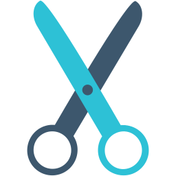

 

# Flutter Snippets

Supercharge your Flutter workflow with handy Snippets for VS Code

---
## Table of Contents
<!--- - [Installation](#installation) -->
<!--- - [Contribution](#contribution)--->
- [Snippets](#snippets)
- [Contributors](#contributors)
- [License](#license)

---
# Snippets

## Flutter Snippets
|Snippet|Widget|Description|
| ----- | ---- | --------- |
| `fscaf` | Scaffold Widget| Creates a Scaffold widget|
| `fex` | Expanded Widget| Creates a Expanded widget|
| `ftxt` | Text Widget| Creates a Text widget|
| `fic` | Icon Widget| Creates a Icon widget|
| `fcont` |Container Widget| Creates a Container widget|
| `fcent` |Center Widget| Creates a Center widget|
| `frow` | Row Widget| Creates a Row widget|
| `fcol` | Column Widget| Creates a Column widget|
| `fstk` | Stack Widget| Creates a Stack widget|
| `falign` |Align Widget| Creates a Align widget|
| `ftextbtn` | TextButton Widget| Creates a TextButton widget|
| `fab` | FloatingActionButton Widget| Creates a FloatingActionButton widget|
| `ficbtn` | IconButton Widget| Creates a IconButton widget|
| `felevbtn` | RaisedButton Widget| Creates a RaisedButton widget|
| `fgesdet` | GestureDetector Widget| Creates a GestureDetector widget|
| `fink` | InkWell Widget| Creates a InkWell widget|
| `fdrawer` | Drawer Widget| Creates a Drawer widget|
| `fmeque` | MediaQuery Widget| Creates a MediaQuery widget|
| `ftheme` | Theme Widget| Creates a Theme widget|
| `flogo` | FlutterLogo Widget| Creates a FlutterLogo widget|
| `fszb` | SizedBox Widget| Creates a SizedBox widget|
| `fszbw` | SizedBox Widget with width| Creates a SizedBox widget with width|
| `fszbh` | SizedBox Widget with height| Creates a SizedBox widget with height|
| `flistv` | ListView Widget| Creates a ListView widget|
| `fnav` | Navigation Widget| Creates the Navigation widget|
| `fpop` | Navigator pop| Creates the Navigator pop function|

## Import Snippets
|Import|Package|Description|
| ----- | ---- | --------- |
| `impM` | material Package | Import Material package|
| `impC` | cupertino Package | Import Cupertino package|
| `impS` | services Package | Import Services package|
| `impF` | foundation Package | Import Foundation package|
| `impH` | http Package | Import HTTP package|
| `impURL` | url_launcher Package | Import URL_Launcher package|
| `impP` | provider Package | Import Provider package|
| `impGF` | google_fonts Package | Import Google_Fonts package|
| `impPP` | path_provider Package | Import Path_Provider package|
| `impB` | flutter_bloc Package | Import Flutter_Bloc package|
| `impGF` | sqflite Package | Import Sqflite package|
| `impFS` | flutter_screenutil Package | Import Flutter_Screenutil package|
| `impI` | intl Package | Import Intl package|
| `impR` | riverpod Package | Import Riverpod package|
| `impHooks` | flutter_hooks Package | Import Flutter_Hooks package|

## Shortcut Snippets
|Shortcut|Expanded|Description|
| ----- | ---- | --------- |
| `screen` | Scaffold with text | Creates a screen with text in center|
| `devprev` | Device Preview | Creates a screen with the syntax of Device Preview Package|
| `mateapp` | Material App | Creates a new screen with Material App|
| `cupeapp` | Cupertino App | Creates a new screen with Cupertino App|
| `build` | Build Method | Describes the part of the user interface represented by the widget.|
| `customPainter` | Custom Painer | Creates custom painter|
| `customClipper` | Custom Clippers | Creates custom clippers|
| `initS` | InitState | Called when this object is inserted into the tree. The framework will call this method exactly once for each State object it creates.|
| `dis` | Dispose | Called when this object is removed from the tree permanently. The framework calls this method when this State object will never build again.|
| `caa` | CrossAxisAlignment| Creates CrossAxisAlignment|
| `maa` | MainAxisAlignment | Creates MainAxisAlignment|
| `appbar` | Custom AppBar widget | Creates Custom AppBar widget|
| `fstyle` | Flutter TextStyle property | Creates Flutter TextStyle |
| `defaultApp` | Default Counter App | Creates Default Counter App |
| `fstring` | Flutter String snippet | Creates Flutter String snippet |
| `fcolor` | Flutter Color snippet | Creates Flutter Color snippet |
| `fequatable` | Flutter Equatable class snippet | Creates Equatable class snippet |
| `fapptext` | Flutter AppText class snippet | Creates AppText class snippet for Strings used in app|
| `fappimage` | Flutter AppImage class snippet | Creates AppImage class snippet for Image assets used in app|
| `fappcolor` | Flutter AppColors class snippet | Creates AppColors class snippet for Color used in app|
| `freezed` | Flutter Freezed class snippet | Creates Freezed class snippet|

## Riverpod Snippets
|Snippet|Expanded|Description|
| ----- | ---- | --------- |
| `stlessConsumer` |ConsumerStatelessWidget snippet | Create a Flutter ConsumerStatelessWidget snippet|
| `stfulConsumer` |  ConsumerStatefulWidget snippet | Creates Flutter ConsumerStatefulWidget snippet |
| `changeNotifierProvider` |  ChangeNotifierProvider snippet | Creates Flutter ChangeNotifierProvider snippet |
| `changeNotifier` |  ChangeNotifier snippet | Creates Flutter ChangeNotifier snippet |
| `futureProvider` |  FutureProvider snippet | Creates Flutter FutureProvider snippet |
| `stlessHookConsumer` |  HookConsumerWidget snippet | Creates Flutter HookConsumerWidget snippet |
| `stfulHookConsumer` |  StatefulHookConsumerWidget snippet | Creates Flutter StatefulHookConsumerWidget snippet |
| `provider` |  Provider snippet | Creates Flutter Provider snippet |
| `stateNotifierProvider` |  StateNotifierProvider snippet | Creates Flutter StateNotifierProvider snippet |
| `stateNotifier` |  StateNotifier snippet | Creates Flutter StateNotifier snippet |
| `stateProvider` |  StateProvider snippet | Creates Flutter StateProvider snippet |
| `streamProvider` |  StreamProvider snippet | Creates Flutter StreamProvider snippet |

## Android Permission Snippets
|Permission|Expanded|Description|
| ----- | ---- | --------- |
| `perInt` | INTERNET Permission | Android Internet permission|

---

# Contributors

 <table>
  <tr>
    <td align="center"><a href="https://github.com/zyllus17"> <b>Maruf Hassan</b></a> <a href="#creator" title="Creator">🌐</a> <a href="https://github.com/zyllus17" title="Documentation">📖</a> <a href="https://github.com/zyllus17/Ultimate-Flutter-Extension-Pack/pulls" title="Review Pull Requests">👀</a> <a href="#maintenance-tbenning" title="Maintenance">🚧</a></td>
    </td>
</tr>
</table>

## Requirements

Vscode: ^1.51.0
## License

**[MIT license](https://github.com/zyllus17/flutter-snippets/blob/master/LICENSE)**

## Contact me 

## Reference

[Flutter Widget Snippet](https://github.com/Alexisvt/flutter-snippets)

[Awesome Flutter Snippet](https://github.com/Nash0x7E2/awesome-flutter-snippets)

[Flutter Riverpod Snippets](https://github.com/RobertBrunhage/flutter-riverpod-snippets)
